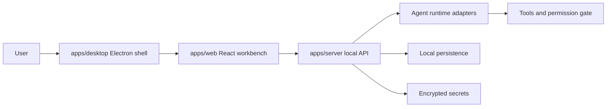

# Architecture

NexaDesk is intentionally small, but its boundaries match a larger agent workbench.

## Layers



## Current implementation

- `apps/web` renders the cowork console and fetches `/api/snapshot`.
- `apps/server` serves settings, sessions, model streaming, agent tools, approvals, and a Server-Sent Events activity stream.
- `apps/desktop` starts the bundled local API, loads the built web app, and redirects data paths into Electron's user data directory.
- `packages/shared` owns the app contracts so frontend and backend do not drift.
- Desktop secrets are encrypted with AES-256-GCM when `NEXADESK_SECRET_KEY` is set. Electron creates that key and protects it with `safeStorage`.
- The approval queue gates high-risk write, shell, browser, and image generation actions.

## Planned runtime boundary

Each runtime adapter should implement the same basic shape:

```ts
interface AgentRuntimeAdapter {
  detect(): Promise<boolean>;
  startSession(input: StartSessionInput): Promise<RuntimeSession>;
  sendMessage(sessionId: string, content: string): Promise<void>;
  stopSession(sessionId: string): Promise<void>;
}
```

Initial adapters can be simple wrappers around CLI processes or OpenAI-compatible HTTP APIs. The UI should not care which model or process powers the session.

## Desktop Runtime

Desktop startup does four things:

1. Creates an Electron user data directory for local settings and encrypted secrets.
2. Generates or loads a `safeStorage`-protected master key.
3. Starts the bundled Express API from `apps/server/dist/index.cjs`.
4. Loads `apps/web/dist/index.html` with a query-scoped API base URL.

This keeps desktop installs independent from the source checkout. The project-local `data/*.json` files remain development-only and are ignored by Git.

