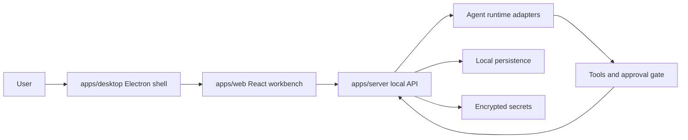
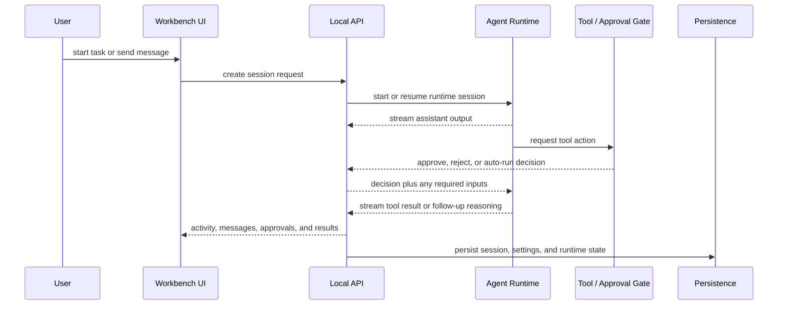

# Architecture

NexaDesk is a local-first agent workbench. Its architecture is intentionally small, but the boundaries are strict: the UI observes work, the API brokers work, the runtime plans work, and the tool layer performs risky work only after the right checks.

## Core Principles

- Local first: user data, sessions, settings, and diagnostics stay on the machine by default.
- Explicit actions: agent behavior must be inspectable, not hidden inside the chat stream.
- Separated concerns: model providers, agent runtimes, tools, approvals, and persistence are distinct layers.
- Shared contracts: frontend and backend use the same TypeScript shapes so behavior does not drift.
- Testable paths: every important boundary should be covered by smoke tests or unit tests.

## System Overview



The user interacts with the desktop shell, the shell loads the React workbench, and the workbench talks to the local API. The API is the boundary that starts sessions, streams events, mediates approvals, and persists state. Agent runtimes never talk directly to the UI.

## Runtime Layers

### `apps/web`

- Renders the workbench, task views, tool activity, approval queue, and workspace context.
- Sends user intent to the local API and renders streamed events back to the user.
- Treats the API as the source of truth for sessions, approvals, and stored runtime state.

### `apps/desktop`

- Boots the local API and loads the built web app.
- Redirects settings, session state, and logs into Electron's user data directory.
- Owns desktop-specific security behaviors such as protected secret storage and installer packaging.

### `apps/server`

- Exposes settings, session, model streaming, tool, approval, and diagnostics endpoints.
- Owns the agent runtime adapter boundary.
- Enforces approval rules before high-risk tool actions are executed.
- Persists runtime state so sessions can survive restart.

### `packages/shared`

- Defines request, response, tool, assistant, provider, approval, and state contracts.
- Prevents frontend/backend shape drift.
- Should contain the smallest possible shared surface needed by both sides.

## Agent Execution Flow



The key rule is that the runtime plans and the API governs. The UI does not decide tool policy, and the runtime does not bypass approvals for risky actions.

## Agent Runtime Boundary

The project separates model providers from agent runtimes.

- A model provider is the source of completions or streaming responses.
- An agent runtime is the execution engine that turns user intent into a plan, tool requests, and follow-up messages.
- The UI should not care whether the runtime comes from a built-in adapter, a CLI engine, or an HTTP API.

A runtime adapter should expose a shape similar to this:

```ts
interface AgentRuntimeAdapter {
  detect(): Promise<boolean>;
  startSession(input: StartSessionInput): Promise<RuntimeSession>;
  sendMessage(sessionId: string, content: string): Promise<void>;
  stopSession(sessionId: string): Promise<void>;
}
```

Adapters can be thin wrappers around CLI processes or OpenAI-compatible HTTP APIs. The important requirement is consistency: the UI and server should not need special-case code for every runtime brand.

## Tool And Approval Model

Tool execution is the highest-risk part of the system, so it is separated from the chat flow.

- Low-risk tools may run automatically when the runtime and policy allow it.
- High-risk tools must be approved before they can write files, run shell commands, browse the web, or generate images.
- Approvals should be visible in the workbench and persisted with the session history.
- Tool outputs should be streamed back as explicit events, not hidden inside a generic assistant reply.

The roadmap currently treats these as the main tool categories:

- read-only workspace inspection
- write operations
- shell execution
- browser actions
- image generation

That split is what keeps the workbench usable for trusted testers while still letting the agent do real work.

## Persistence Model

NexaDesk should keep the important state local and recoverable.

- Settings belong in the Electron user data directory for desktop mode.
- Session history, chat messages, approvals, and runtime activity are saved locally.
- The API should restore the last known state after restart whenever possible.
- Secret material should be encrypted at rest and never copied into logs or snapshots.

The current implementation uses Electron `safeStorage` to protect the master key, and provider API keys are encrypted before being written to disk.

## Desktop Startup

Desktop startup follows a fixed path:

1. Create or locate the Electron user data directory.
2. Load or generate the protected master key.
3. Start the bundled Express API.
4. Load the built web app with the local API base URL.

This keeps installed desktop builds independent from the source checkout and allows the same app to be tested in both source and packaged modes.

## Current Implementation Notes

- `apps/web` renders the cowork console and reads `/api/snapshot`.
- `apps/server` serves settings, sessions, model streaming, agent tools, approvals, and an SSE activity stream.
- `apps/desktop` starts the bundled API, loads the built web app, and redirects local data paths into Electron's user data directory.
- `packages/shared` owns the app contracts so frontend and backend do not drift.
- Desktop secrets are encrypted with AES-256-GCM when `NEXADESK_SECRET_KEY` is set, and Electron protects that key with `safeStorage`.
- The approval queue gates write, shell, browser, and image-generation actions.

## Non-Goals For Now

- Remote multi-user collaboration
- Public release packaging
- App signing and automatic updates
- Plugin marketplace
- Mobile pairing
- A durable cloud session backend

These can come later. The current architecture is optimized for a private, testable desktop agent that can be observed and trusted before it is expanded.